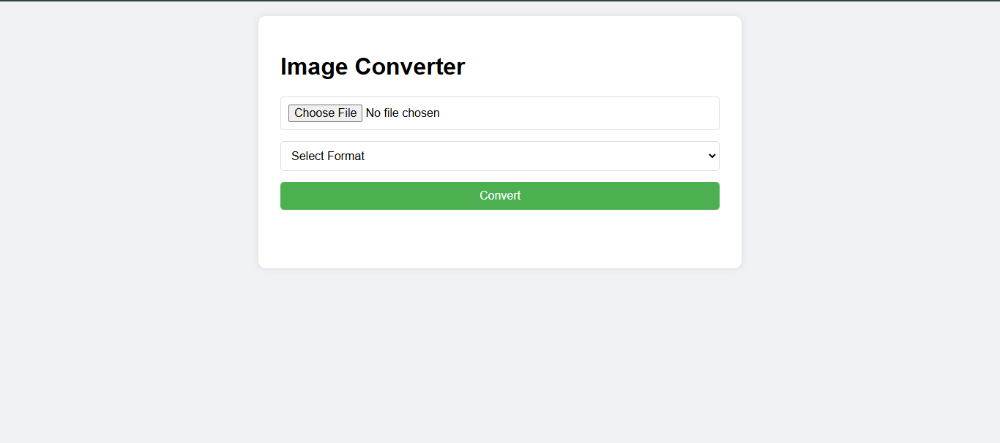

# Image Format Converter

A web-based tool to convert images between various formats (JPEG, PNG, GIF, WebP, BMP) using Flask (Python backend) and HTML/CSS/JS frontend.

 
*Screenshot of the App*

## Features

- Convert between popular image formats: JPEG, PNG, GIF, WebP, and BMP
- Automatic handling of transparent backgrounds for formats that don't support transparency
- Simple and intuitive user interface
- Direct download of converted files
- Error handling and user feedback
- Cross-platform compatibility

## Prerequisites

- Python 3.7 or higher
- pip package manager
- Web browser with JavaScript support

## Installation

1. **Clone the repository**
    ```bash
    git clone https://github.com/aftabalikhandeveloper/image-conversion.git
    cd image-converter
    ```
    2. **Install Dependencies**

        ```bash
        pip install -r requirements.txt
        ```

    3. **Run the Application**

        ```bash
        python app.py
        ```

## Author

*Aftab Ali Khan*